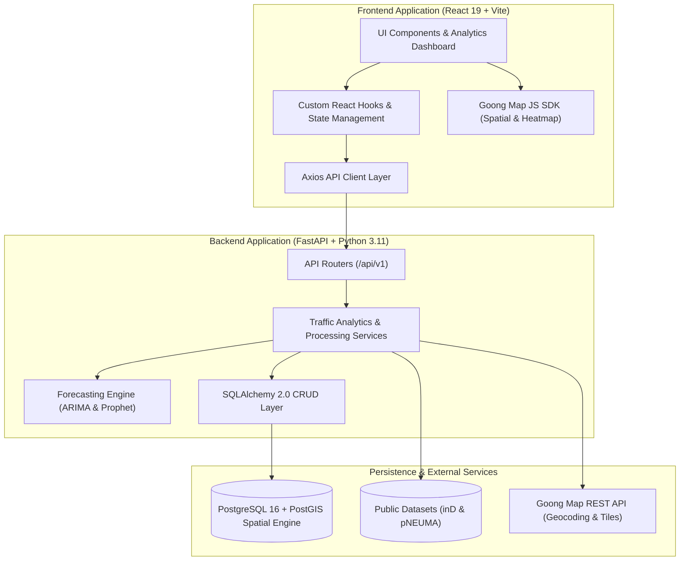

# 🚦 Urban Traffic Analytics & Short-Term Congestion Forecasting

<div align="center">


**An End-to-End Web Platform for Spatial-Temporal Traffic Pattern Analysis & Short-Term Congestion Forecasting Using UAV-Collected Trajectory Data**

*Capstone Project FA26SE155 • FPT University Ho Chi Minh City • Fall 2026*

[Features](#-key-features) • [System Architecture](#-system-architecture) • [Tech Stack](#-tech-stack) • [Quick Start](#-quick-start-guide) • [Project Structure](#-project-structure) • [Team](#-project-team)

</div>

---

## 📌 Executive Summary

Urban traffic congestion presents severe economic, environmental, and public safety challenges in modern metropolitan centers. Recent advancements in **Unmanned Aerial Vehicle (UAV)** technology enable the capture of high-resolution, microscopic vehicle trajectory datasets (such as **inD** and **pNEUMA**). However, modern traffic researchers and urban analysts encounter severe workflow fragmentation—relying on disconnected Python scripts, desktop simulation suites (like SUMO), and generic forecasting tools (like Forecast Pro) that lack spatial awareness.

This project delivers a **unified, web-based Urban Traffic Analytics Platform** that bridges the gap between spatial vehicle trajectories and time-series forecasting:
1. **UAV Dataset Management & Validation**: Ingests, validates, cleans, and versions raw drone trajectory data.
2. **Spatial-Temporal Pattern Mining**: Computes vehicle density, flow velocity, and identifies congestion hotspots using PostGIS spatial indexing.
3. **Dual Forecasting Engine**: Transforms continuous trajectories into aggregated time-series (1m, 5m, 15m) and predicts near-future congestion (15–60 minutes) using **ARIMA** and **Facebook Prophet**.
4. **Interactive GIS Visualization**: Provides interactive traffic heatmaps, trajectory replays, and spatial analytics using **Goong Map API**.
5. **Reproducible Experiment Management**: Centralized hyperparameter logging, benchmark evaluation (MAE, RMSE, MAPE, $R^2$), and PDF/Excel reporting.

---

## ✨ Key Features

| Module | Features & Capabilities |
| :--- | :--- |
| 🛸 **UAV Dataset Pipeline** | Multi-format upload (CSV, JSON), automated data-cleaning & quality validation (missing coordinates, negative speeds, invalid timestamps), dataset versioning & archiving (`PASSED` / `FAILED` status flags). |
| 🗺️ **Interactive GIS Heatmaps** | Integration with **Goong Map SDK**, real-time density heatmaps, spatial Region of Interest (ROI) filtering, and dynamic trajectory overlays. |
| 📊 **Traffic Pattern Analysis** | Quantitative analysis of vehicle counts, average speeds, traffic flow, spatial density, peak-hour detection, and bottleneck recognition. |
| 📈 **Short-Term Forecasting** | Dual statistical & ML forecasting engine (**ARIMA** & **Prophet**) with configurable time aggregation intervals (1, 5, 15 minutes) predicting traffic conditions 15–60 minutes in advance. |
| 🔬 **Experiment Tracking** | Reproducibility engine storing dataset versions, hyperparameters, and evaluation metrics (**MAE, RMSE, MAPE, $R^2$**) for side-by-side model benchmarking. |
| 📑 **Reporting & Export** | One-click export of analysis findings, forecasting benchmarks, and spatial heatmaps into formal **PDF & Excel** reports. |
| 🛡️ **Role-Based Access Control** | Dedicated user authorization and audit trails for 4 system roles: `Administrator`, `Researcher`, `Traffic Analyst`, and `Student`. |

---

## 🏛️ System Architecture

The platform follows a clean, decoupled, layered microservice/modular architecture:



---

## 🛠️ Tech Stack

### Backend
* **Language & Runtime**: Python 3.11+
* **Framework**: FastAPI (Asynchronous REST API)
* **Package Manager**: `uv` (Ultra-fast Python package manager)
* **ORM & Database Tooling**: SQLAlchemy 2.0, GeoAlchemy2, Alembic
* **Forecasting & Data Processing**: Statsmodels (ARIMA), Prophet, Pandas, NumPy, Scikit-learn
* **Linter & Code Quality**: Ruff

### Frontend
* **Core Library**: React 19
* **Build Tool**: Vite
* **Icons**: Lucide React
* **Maps & GIS**: Goong Map JS SDK
* **Code Quality**: Oxlint

### Database & Infrastructure
* **Database Engine**: PostgreSQL 16
* **Spatial Extension**: PostGIS 3.4 (High-performance geometric & spatial indexing)
* **Containerization**: Docker Compose
* **Configuration Management**: Pydantic Settings

---

## 📂 Project Structure

```text
Capstone_Project/
├── BE/                           # Backend Application (FastAPI)
│   ├── app/
│   │   ├── api/v1/               # API Routers & Endpoints
│   │   ├── core/                 # App Settings & Database Session
│   │   ├── crud/                 # Database Query Operations (SQLAlchemy)
│   │   ├── models/               # Database ORM Models
│   │   ├── schemas/              # Pydantic Request & Response Schemas
│   │   ├── services/             # Business Logic & Analytics Services
│   │   └── main.py               # FastAPI Application Entrypoint
│   ├── pyproject.toml            # Backend Dependencies & Configuration
│   ├── uv.lock                   # Deterministic Dependency Lock
│   └── README.md
├── FE/                           # Frontend Application (React 19 + Vite)
│   ├── src/
│   │   ├── components/           # Reusable UI Components
│   │   ├── features/             # Feature-specific Modules & Views
│   │   ├── hooks/                # Custom React Hooks
│   │   ├── services/             # Axios API Client Services
│   │   ├── App.jsx               # Application Root Component
│   │   └── main.jsx              # React DOM Entrypoint
│   ├── package.json              # Frontend Dependencies & Scripts
│   └── vite.config.js            # Vite Bundler Configuration
├── docs/                         # System Documentation & Specifications
├── docker-compose.yml            # Local PostgreSQL + PostGIS Container Setup
├── dev.ps1                       # PowerShell Local Backend Launcher
├── AGENTS.md                     # AI Autonomous Execution Guidelines
└── CONTRIBUTING.md               # Git Workflow & Conventional Commits
```

---

## 🚀 Quick Start Guide

### 1. Prerequisites
Ensure you have the following installed on your machine:
* [Docker Desktop](https://www.docker.com/products/docker-desktop/) (for PostgreSQL + PostGIS)
* [Python 3.11+](https://www.python.org/downloads/) and [`uv`](https://docs.astral.sh/uv/) (`pip install uv` or `curl -LsSf https://astral.sh/uv/install.sh | sh`)
* [Node.js 18+](https://nodejs.org/) & `npm`

---

### 2. Start Database (PostGIS)

Launch the spatial PostgreSQL container:
```bash
docker compose up -d
```
> [!NOTE]
> Database will be exposed at `localhost:5432` with PostGIS extension pre-installed.

---

### 3. Start Backend Server

Using `uv` with fast virtualenv sync:
```powershell
# Windows (via helper script)
.\dev.ps1

# Or manually:
uv --directory BE run uvicorn app.main:app --reload --port 8000
```
* **API Server**: `http://localhost:8000`
* **Interactive Swagger Docs**: `http://localhost:8000/docs`
* **Alternative ReDoc**: `http://localhost:8000/redoc`

---

### 4. Start Frontend Application

In a new terminal window:
```bash
cd FE
npm install
npm run dev
```
* **Frontend Web App**: `http://localhost:5173`

---

## 🔬 Forecasting & Evaluation Methodology

The platform implements an automated pipeline to benchmark short-term traffic predictions:

```text
Raw Trajectories (inD / pNEUMA)
              │
              ▼
   Data Quality Validation (Coordinates, Missing Fields, Timestamps)
              │
              ▼
   Spatial Discretization & ROI Filtering (PostGIS)
              │
              ▼
   Temporal Aggregation (1-minute, 5-minute, 15-minute Buckets)
              │
              ▼
   Model Training & Inference:
       ├── ARIMA (AutoRegressive Integrated Moving Average)
       └── Facebook Prophet (Additive Non-linear Trend & Seasonality)
              │
              ▼
   Evaluation & Benchmark:
       ├── MAE  (Mean Absolute Error)
       ├── RMSE (Root Mean Squared Error)
       ├── MAPE (Mean Absolute Percentage Error)
       └── R²   (Coefficient of Determination)
```

---

## 🤝 Contribution & Git Guidelines

We strictly enforce the **Feature-Branch GitFlow** and **Conventional Commits**:

### Branching Convention
* `main`: Production releases only.
* `dev`: Primary integration branch.
* `feature/<feature-name>`: Isolated feature development (e.g. `feature/traffic-analysis`).
* `fix/<bug-name>`: Bug fixes (e.g. `fix/timestamp-validation`).

### Commit Message Standard
```text
feat: add traffic density calculation algorithm
fix: validate missing timestamps and negative speed entries
test: add unit tests for ARIMA forecasting service
docs: update API documentation for dataset upload endpoints
refactor: optimize trajectory spatial aggregation pipeline
chore: update dependency packages
```
For full development standards, consult [AGENTS.md](./AGENTS.md) and [CONTRIBUTING.md](./CONTRIBUTING.md).

---

## 👥 Project Team (GFA26SE128)

**Capstone Project FA26SE155 — Fall 2026**  
*Department of Software Engineering, FPT University Ho Chi Minh City*

* **Academic Supervisor**: **Mr. Ngo Dang Hai An** (`anndh2@fe.edu.vn`)
* **Project Team**:
  * **Nguyen Xuan Truong** (Leader) — `truongnxse182688@fpt.edu.vn`
  * **Hoang Huu Nhat Huy** — `huyhhnse183417@fpt.edu.vn`
  * **Nguyen Duy Khang** — `khangndse184511@fpt.edu.vn`
  * **Le Minh Huy** — `huylmse182698@fpt.edu.vn`

---

## 📄 License & Attribution

This project is developed for educational and academic research purposes as part of the Capstone Graduation Project at FPT University.  
Traffic datasets used: [inD Dataset](https://www.ind-dataset.com/) and [pNEUMA Dataset](https://open-traffic.epfl.ch/).
