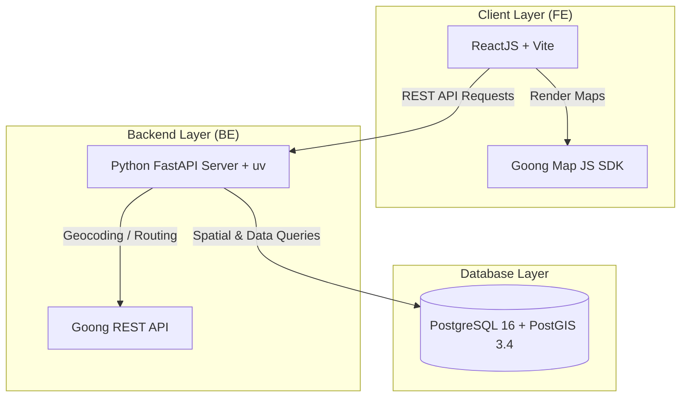

# 🏛️ Tổng Quan Kiến Trúc Hệ Thống (System Architecture)

Document này mô tả sơ đồ kiến trúc tổng thể của dự án **Capstone Urban Traffic Pattern Analysis**.

## 📐 Sơ Đồ Khối Kỹ Thuật

## 🛠️ Tech Stack Chi Tiết

* **Frontend (`FE/`)**: ReactJS (Vite), Axios, TailwindCSS, `@goongmaps/goong-js`.
* **Backend (`BE/`)**: Python 3.11, FastAPI, Uvicorn, SQLAlchemy 2.0, Pydantic v2, GeoAlchemy2, `uv` Package Manager.
* **Database**: PostgreSQL 16 với PostGIS extension.
* **Quy chuẩn Code**: Xem chi tiết tại [AGENTS.md](../AGENTS.md).
