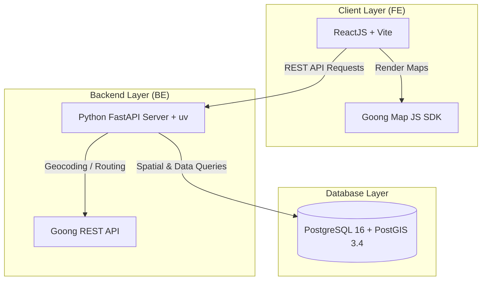

# 🏛️ System Architecture Overview

This document describes the technical architecture for the **Capstone Urban Traffic Pattern Analysis** project.

## 📐 System Block Diagram

## 🛠️ Detailed Tech Stack

* **Frontend (`FE/`)**: ReactJS (Vite), Axios, TailwindCSS, `@goongmaps/goong-js`.
* **Backend (`BE/`)**: Python 3.11, FastAPI, Uvicorn, SQLAlchemy 2.0, Pydantic v2, GeoAlchemy2, `uv` Package Manager.
* **Database**: PostgreSQL 16 with PostGIS extension.
* **Coding Standards**: Refer to [AGENTS.md](../AGENTS.md).